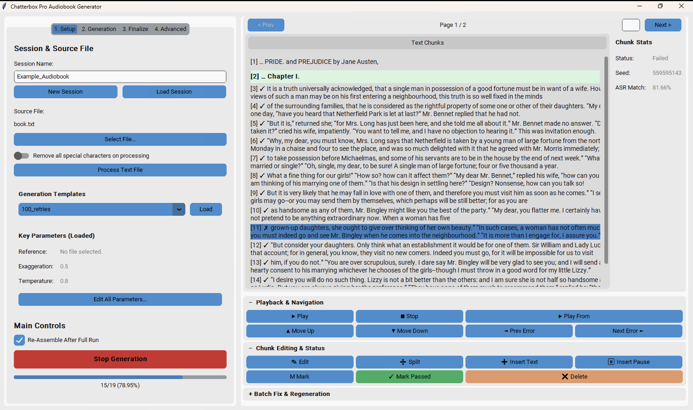

# Chatterbox Pro Audiobook Generator


**Chatterbox Pro** is a powerful, user-friendly graphical interface for generating high-quality audiobooks using the cutting-edge **Chatterbox** text-to-speech model. This tool is designed for creators, authors, and hobbyists who want to convert long-form text into professional-sounding audio with a consistent, cloned voice.

This application provides a complete end-to-end workflow: from text processing and voice cloning to multi-GPU audio generation and final audiobook assembly.


## ✨ Features

-   **High-Quality Voice Cloning**: Utilizes the Chatterbox model to clone a voice from a short audio sample.
-   **Intuitive GUI**: A clean, tab-based interface built with CustomTkinter for easy navigation and control.
-   **Comprehensive Text Processing**:
    -   Supports various input formats: `.txt`, `.pdf`, `.epub`, and with Pandoc installed, `.docx` and `.mobi`.
    -   Intelligent sentence and chapter detection.
    -   In-app text editor for reviewing and correcting source material before processing.
-   **Powerful Generation Controls**:
    -   Adjust TTS parameters like emotional exaggeration, temperature, and speaker similarity (CFG).
    -   Set a master seed for reproducible audio outputs across multiple generation runs.
-   **Multi-GPU & Multi-Core Processing**:
    -   Accelerate generation by distributing the workload across multiple GPUs and CPU cores.
    -   Smart "Fastest First" ordering prioritizes longer chunks to maximize hardware utilization.
-   **ASR-Powered Validation & Failure Handling**:
    -   Automatically transcribe generated audio and compare it to the source text to ensure accuracy.
    -   If a chunk fails validation, the *best-sounding failure* is used as a placeholder, eliminating silent gaps.
    -   Failed chunks are automatically marked for easy, one-click regeneration with different seeds.
-   **Advanced Playlist Management**:
    -   Edit, delete, split, merge, and insert new text blocks or pauses directly into the playlist.
    -   The entire project is automatically renumbered and saved.
-   **Streamlined Project Management**:
    -   Session-based workflow saves all your text, generated audio, and settings.
    -   Save and load generation parameter templates for consistent results across projects.
-   **Professional Post-Processing**:
    -   Optional audio normalization (via `ffmpeg`) and silence removal (via `auto-editor`) for a polished final product.


## 🔧 Installation

This project requires Python 3.9 or higher. An NVIDIA GPU with CUDA support is highly recommended for optimal performance.

### 1. System Dependencies

For full functionality, you need to install these command-line tools and ensure they are in your system's PATH.

-   **FFmpeg**: Required for audio normalization and assembling the final audiobook.
    -   Download from [ffmpeg.org](https://ffmpeg.org/download.html).
-   **auto-editor**: Required for smart silence removal.
    -   Install via pip: `pip install auto-editor`
-   **Pandoc (Optional)**: Required for processing `.docx` and `.mobi` files.
    -   Download from [pandoc.org](https://pandoc.org/installing.html).

The application will still run without these, but the corresponding features will be disabled.

### 2. Clone the Repository

```bash
git clone [https://github.com/your-username/chatterboxPro_updated.git](https://github.com/your-username/chatterboxPro_updated.git)
cd chatterboxPro_updated
````

*(Replace `your-username` with your actual GitHub username)*

### 3\. Create a Virtual Environment and Install Dependencies

It is highly recommended to use a virtual environment to avoid conflicts with other Python projects.

```bash
# Create a virtual environment
python -m venv venv

# Activate it
# On Windows:
venv\Scripts\activate
# On macOS/Linux:
source venv/bin/activate

# Install the required Python packages
pip install -r requirements_pro.txt
```

**Note:** The `chatterbox` model code is already included in this repository, so no additional setup is needed. They may have released newer versions (And there is a 2-4x faster fork that I've struggled to get running in my environment that you might want to explore.)

## 🚀 How to Use

1.  **Launch the Application**:

    ```bash
    python chatter_pro.py
    ```

2.  **Tab 1: Setup**

      - **Create a Session**: Click "New Session" and give your project a name (e.g., `my-first-book`). All files will be saved in an `Outputs_Pro/<session_name>` directory.
      - **Select Source File**: Click "Select File..." to choose your text document (`.txt`, `.pdf`, `.epub`, etc.).
      - **Process Text**: Click "Process Text File". An editor window will pop up. Review your text and make any corrections, then click "Confirm". Your text will be split into chunks and displayed in the playlist on the right.

3.  **Tab 2: Generation**

      - **Reference Audio**: Select a high-quality, clean WAV file (10-30 seconds is ideal) of the voice you want to clone.
      - **Adjust Parameters**: Fine-tune settings like **Exaggeration**, **CFG Weight**, and **Temperature**. You can save your favorite settings as a template for later use.

4.  **Start Generation**

      - Go back to the **Setup** tab and click the big **"Start Generation"** button.
      - The progress bar will update as chunks are generated. Failed chunks (which did not pass ASR) will be marked in red but will still have placeholder audio.

5.  **Review and Regenerate**

      - Listen to the generated audio clips by selecting them in the playlist and clicking "▶ Play".
      - Failed chunks are automatically marked. To retry them, you can adjust settings (e.g., change the "Master Seed") and click **"↻ Regenerate Marked"** in the playlist controls.

6.  **Tab 3: Finalize**

      - Once you are happy with all the generated audio, enable any desired post-processing options like normalization.
      - Click **"Assemble as Single File"** or **"Export by Chapter..."** to create your final audiobook.

\

## 📜 Licensing

Chatterbox Pro is released under a dual-license model to support its ongoing development while providing a free and open-source version for the community.

### Open Source License (AGPLv3)

For personal projects, academic research, and open-source software, Chatterbox Pro is licensed under the **GNU Affero General Public License v3.0 (AGPLv3)**. A key condition of this license is that if you use this software in a network-based service, you must make the full source code of your service available to its users. For the full terms, please see the [LICENSE.md](LICENSE.md) file.

**TL;DR:** If you are an author using this tool to create audiobooks for personal or commercial distribution, you are not required to open-source your work. The AGPLv3 applies to modifications of the software itself when used in a networked service.

### Commercial License

For businesses and commercial use cases where the obligations of the AGPLv3 are not suitable, we offer a commercial license. This allows you to integrate Chatterbox Pro into proprietary applications and services without the source-sharing requirements.

To inquire about a commercial license, please **[open an issue on GitHub using our Commercial License Inquiry template](https://www.google.com/search?q=https://github.com/your-username/chatterboxPro_updated/issues/new%3Ftemplate%3Dcommercial-license-inquiry.md%26title%3DCommercial%2BLicense%2BInquiry)**.

## 🙏 Acknowledgements & Attributions

This project is a graphical user interface built on top of the powerful **Chatterbox TTS model** by Resemble AI and takes inspiration from several other incredible open-source projects. All credit for the underlying speech synthesis technology goes to the original creators.

For a detailed list of acknowledgments and licenses, please see the attributions.md file.

